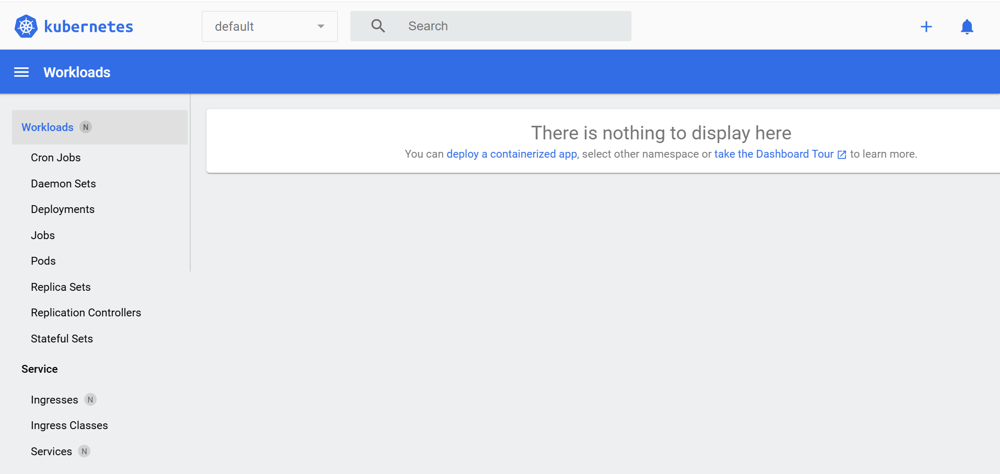

//Installare Helm 
//`winget install Helm.Helm`

# Comandi preliminari

`minikube delete`: reset completo dell'enviroment k8s

`minikube start --insecure-registry="host.docker.internal:5000"` Avviare minikube

`minikube addons list` e `kubectl get po -A` Comando di verifica corretto avvio minikube

# Che cos'è il Matric Server?
Il Stat server è un server di metriche ed è uno strumento Kubernetes utilizzato per raccogliere dati sull'utilizzo delle risorse per pod e nodi nel cluster Kubernetes. È basato sull'API delle metriche, quindi può essere utilizzato per ottenere metriche come l'utilizzo di CPU e memoria.
È quindi possibile utilizzare queste metriche per determinare come scalare il cluster e allocare le risorse. Poiché il server delle metriche è distribuito come pod, è possibile utilizzarlo per ottenere metriche da diverse fonti, come kubelet, API Kubernetes e cAdvisor.
 
`minikube addons enable metrics-server` Abilitare il server delle metriche

`minikube addons list` Verificare che il metrics server è enable

`kubectl top nodes` stato dei nodi tramite metriche CPU e RAM

Il diagramma mostra una panoramica di alto livello di come funziona HPA (Horizontal Pod Autoscaling) in combinazione con metrics-server:

# Che cos'è la dashboard di k8s?
`minikube dashboard` Abilitare il server

La console di k8s (dashboard) permette di avere una visione sintetica ed in tempo reale:
- Verificare lo stato di Cluster, Nodi, Namespace, Pod, Service, Ingress, Deployment.
- Creare, modificare e cancellare oggetti (Deployment, Service, ConfigMap, Secret, ecc.).
- Monitoraggio risorse
- Visualizzare CPU e memoria (se hai il metrics-server attivo).
- Capire quali Pod o nodi stanno consumando di più.
- Accedere a Debug e log 

Funzionlaità fondamentale è il filtro che permette di visualizzare le risorse per namespace, utile se hai ambienti dev, test, prod nello stesso cluster o diverse applicazioni.