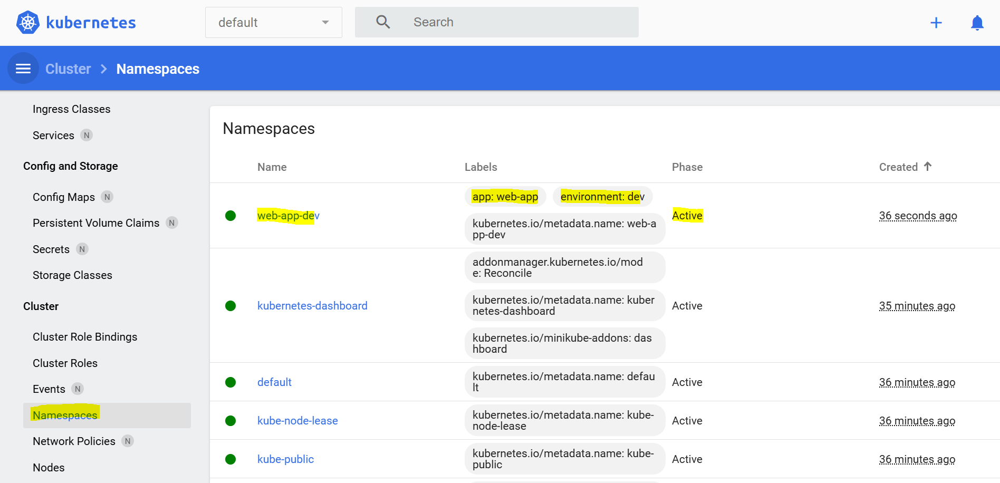
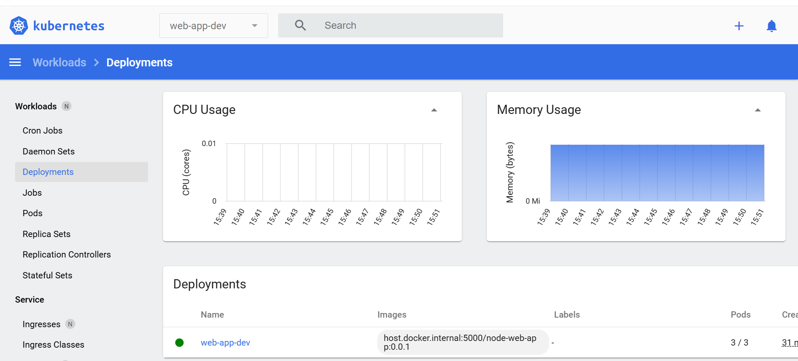
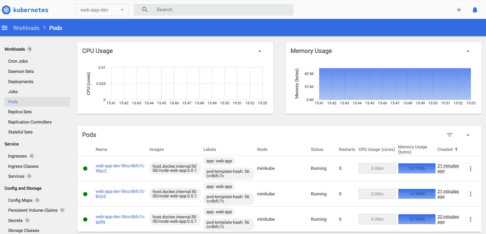

# Gestione di immagini su registry locale
## Avvio di un registry locale su Docker
Il seguente comando avvia un container usando l'immagine "registry:2", lo nomina "local-registry" e rende accessibile il suo web server mappando la porta 5000 del container con la porta 5000 del proprio PC:
```bash
docker run -d --restart=always -p 5000:5000 --name local-registry registry:2
```
Per verificare che l'immagine registry sia in esecuzione, è possibile visitare sul proprio PC l'indirizzo  http://localhost:5000/v2/   
```json
{} 
``` 
Verificare che il catalogo delle immagini sia attivo http://localhost:5000/v2/_catalog   

```json 
{"repositories":[]} 
```
## Tag & Push di immagine su registry locale
### Build locale

dal path /PLASpace\Docker-proj\02.Docker-Example-DockerFile permettere di creare l'immagine  trmaite comando di build 
```bash 
docker build -t node-web-app:0.0.1 .
```

modificare il file docker per poi deploiare l'applicaizone in release 0.0.2
```dockerfile
EXPOSE 8080
#CMD [ "node", "app.js" ]
CMD [ "node", "app2.js" ]
```

Dal path /PLASpace\Docker-proj\02.Docker-Example-DockerFile permettere di creare l'immagine  trmaite comando di build 
```bash 
docker build -t node-web-app:0.0.2 .
```
### Tag verso il registry locale della v0.0.1 del container
```bash
docker tag node-web-app:0.0.1 host.docker.internal:5000/node-web-app:0.0.1`
```
```bash
`docker tag node-web-app:0.0.1 localhost:5000/node-web-app:0.0.1`
```
### Tag verso il registry locale della v0.0.2 del container
```bash 
docker tag node-web-app:0.0.2 host.docker.internal:5000/node-web-app:0.0.2
```
```bash 
docker tag node-web-app:0.0.2 localhost:5000/node-web-app:0.0.2
```
### push al registry
```bash 
docker push host.docker.internal:5000/node-web-app:0.0.1
docker push localhost:5000/node-web-app:0.0.1
```
```bash 
docker push host.docker.internal:5000/node-web-app:0.0.2
docker push localhost:5000/node-web-app:0.0.2
```
### Verificare se il push sul immage registy ha funzionato
verifichiamo che tutte l'applicaizone sia stata pubblicata http://localhost:5000/v2/_catalog 
```json 
{"repositories":["node-web-app"]} 
``` 

e che tutte le versioni siano disponibili http://localhost:5000/v2/node-web-app/tags/list 
```json 
{"name":"node-web-app","tags":["0.0.1","0.0.2"]} 
```
### Verifica che il repository sia ragiungibile da minikube
```bash
minikube ssh "curl -I http://host.docker.internal:5000/v2/"
```
### Avvia minikube con l’host del tuo PC come insecure registry:
```bash 
minikube start --insecure-registry="host.docker.internal:5000"
```
## Creazione Namespase
```bash 
kubectl apply -f namespace-web-app-dev.yaml
```
### Verifica corretta creazione del namespace
```bash 
kubectl get namespaces` 
```
### Verifica orretta creazione del namespace da console

## Deployment della nostra applicaizone web-app-dev
```bash 
kubectl apply -f deployment-web-app-dev.yaml 
```
### Verifica lo stato del deployment
```bash
kubectl get deployment web-app -n web-app-dev
```
dove:
* READY → quanti Pod sono pronti su quanti richiesti.
* UP-TO-DATE → quanti Pod hanno l’ultima versione.
* AVAILABLE → quanti Pod sono effettivamente disponibili.

### verificare dalla dashboard k8s il corretto stato del deployment


### Verifica lo stato dei Pod deployed
```bash
kubectl get pods -n web-app-dev
```
dove:

* READY → quanti container nel Pod sono up (1/1).
* STATUS → Running, Pending, CrashLoopBackOff, ecc.
* RESTARTS → quante volte il container si è riavviato.

### verificare dalla dashboard k8s


a questo punto possiamo modificare yaml file del deployment ed effettuare il deployment della vesione :0.0.2

```yaml 
spec:
      containers:         # lista di container (nel tuo caso 1 container web-app).
        - name: web-app   # nome del Pod
          image: host.docker.internal:5000/node-web-app:0.0.2 # immagine da eseguire
          imagePullPolicy: IfNotPresent                       # Pull dell'immagine se non esiste
          ports:
            - containerPort: 8080 
```

- applicare il comando di deployment
`kubectl apply -f deployment-web-app-dev.yaml`
- verificare la transizione del deployment e dei pod
`kubectl get deployment web-app -n web-app-dev`
- verificare la transizione del dei pod
`kubectl get pods -n web-app-dev`
# considerazioni
## Perché i Deployment in Kubernetes sono una bomba
Uno dei superpoteri *di Kubernetes è il modo in cui gestisce i **Deployment**.  
Non parliamo solo di lanciare qualche container, ma di avere un vero e proprio **autopilota** per le applicazioni: rilasci, scaling e resilienza diventano parte del motore del cluster.

## Release senza downtime
Con un Deployment puoi rilasciare una nuova versione della tua app senza mai staccare la spina agli utenti.  Kubernetes sostituisce i Pod **gradualmente** (Rolling Update), e se qualcosa non funziona puoi fare rollback con un solo comando. Risultato: release continue, fluide e sicure.

## Scalabilità automatica
Hai un picco di traffico? Nessun problema. Con un Deployment puoi scalare manualmente:
```bash
kubectl scale deployment web-app --replicas=10
```

## Self-healing by design
Se un Pod cade o un nodo va giù, Kubernetes crea automaticamente nuove istanze.
Non devi preoccuparti di “riavviare” nulla: il cluster si autoregola. Risultato: applicazioni sempre disponibili.

## Portabilità e coerenza
Che tu stia lavorando in locale con Minikube o in produzione su cloud, i Deployment funzionano allo stesso modo.
Scrivi un file YAML, lo applichi al cluster, e il resto lo fa Kubernetes Risultato: meno differenze tra ambienti, più velocità di consegna.

## Sintesi
** I Deployment in Kubernetes sono la base per fare continuous delivery e scaling automatico in modo elegante.
Sono la prova che Kubernetes non è solo un orchestratore di container, ma una piattaforma che ti permette di innovare senza paura.**