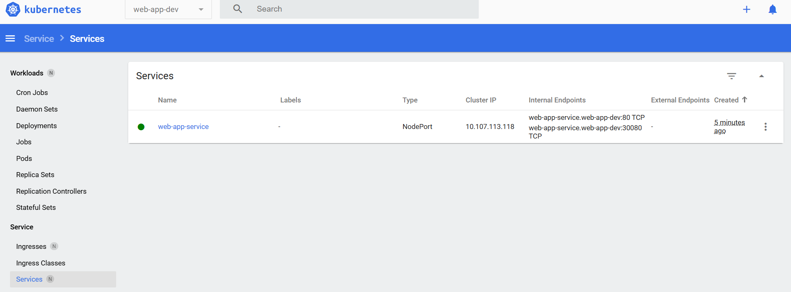

### Applicare il service NodePort
```bash
kubectl apply -f service-NodePort-web-app-dev.yaml
```
### verifica del service del service
```bash 
kubectl get svc web-app-service -n web-app-dev
```
### verifica del service da console


### apreire la porta
```bash
minikube service web-app-service -n web-app-dev --url
```
### richiamare l'url fornito
