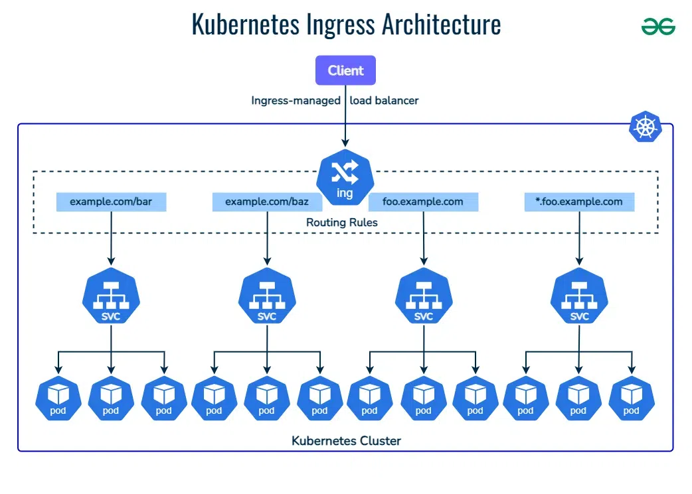

**METTIAMO indice per accedere alle sezioni di livello 1 e 2** @Daniele @Luca

nav:
  - [Concetti Base](https://github.com/lucacodastefano-0805/PLASpace/blob/main/Kubernetes-proj/README.md#concetti-base)
  - [Architettura logica k8s](https://github.com/lucacodastefano-0805/PLASpace/blob/main/Kubernetes-proj/README.md#architettura-logica-k8s)
  - [Architettura fisica k8s](https://github.com/lucacodastefano-0805/PLASpace/blob/main/Kubernetes-proj/README.md#architettura-fisica-k8s)
  - [kubernetes Objects](https://github.com/lucacodastefano-0805/PLASpace/blob/main/Kubernetes-proj/README.md#Kubernetes-Objects)
    - [Namespase](https://github.com/lucacodastefano-0805/PLASpace/blob/main/Kubernetes-proj/README.md#namespace)
    - [Deployment](https://github.com/lucacodastefano-0805/PLASpace/blob/main/Kubernetes-proj/README.md#Deployment)
    - [Service](https://github.com/lucacodastefano-0805/PLASpace/blob/main/Kubernetes-proj/README.md#Service)
    - [Ingress](https://github.com/lucacodastefano-0805/PLASpace/blob/main/Kubernetes-proj/README.md#Ingress)
    - [Release Strategy](https://github.com/lucacodastefano-0805/PLASpace/blob/main/Kubernetes-proj/README.md#Release-Strategy)
    - [HPA e VPA](https://github.com/lucacodastefano-0805/PLASpace/blob/main/Kubernetes-proj/README.md#HPA-e-VPA) 
# Concetti base
## Cos'è Kubenetes
Kubernetes è diventato lo standard de facto per l’orchestrazione di container perché risolve in modo sistemico tutte le complessità che emergono quando si passa dal “far girare un container” al “gestire un ecosistema di applicazioni containerizzate in produzione”.

### Perché Kubernetes come orchestratore di container
*Automazione del ciclo di vita dei container*: Gestisce in automatico il deploy, l’aggiornamento (rolling update), il rollback e il riavvio dei container in caso di errori.

*Scalabilità dinamica*: Supporta autoscaling (HPA, VPA) in base a CPU, memoria o metriche custom, garantendo che le applicazioni rispondano elasticamente ai carichi variabili.

*Alta disponibilità (HA) e resilienza*: Ridistribuisce i container su nodi diversi in caso di failure. Implementa meccanismi di self-healing (riavvio dei pod, rescheduling su altri nodi).

*Networking e Service Discovery*: Fornisce un networking uniforme e un DNS interno per far comunicare i servizi tra loro senza dipendere dagli indirizzi IP.

*Gestione dello storage*: Permette di collegare storage persistenti (es. NFS, Ceph, EBS, Azure Disk) ai container in modo portabile e dinamico.

*Portabilità multi-cloud e hybrid*: È cloud-agnostic: funziona su AWS, Azure, GCP, on-prem e ambienti ibridi senza lock-in forte verso un vendor.

*Ecosistema e community*: Ampio supporto da parte di vendor e open source, con estensioni (Operators, Helm, CRD) che lo rendono estensibile e modulare. È uno standard industriale, riducendo il rischio di scelte tecnologiche “di nicchia”.

*Governance e sicurezza*: Gestione di configurazioni (ConfigMap, Secret), controlli di sicurezza (RBAC, network policy), isolamento (namespace) e compliance.

Kubernetes non serve solo a “far partire” i container (cosa che Docker da solo fa già), ma a gestirli su larga scala, in produzione, con affidabilità, portabilità e automazione.

| **Aspetto**              | **Docker runtime (senza orchestratore)**                | **Kubernetes**                                                                       |
| ------------------------ | ------------------------------------------------------- | ------------------------------------------------------------------------------------ |
| **Gestione container**   | Avvio/stop manuale di container singoli                 | Deploy, scheduling e gestione automatica di cluster di container                     |
| **Scalabilità**          | Manuale (bisogna avviare container uno per uno)         | Autoscaling (HPA, VPA) basato su CPU, memoria, metriche custom                       |
| **Disponibilità**        | Se un container cade, resta fermo finché non lo riavvii | Self-healing: riavvia pod, riassegna workload ad altri nodi                          |
| **Aggiornamenti**        | Manuali, rischio downtime                               | Rolling update, rollback automatico                                                  |
| **Networking**           | Limitato: bridge o host networking                      | Service discovery integrato, DNS interno, bilanciamento del carico                   |
| **Storage**              | Volumi statici legati al singolo host                   | Storage persistente dinamico, compatibile con diversi backend (NFS, Ceph, EBS, ecc.) |
| **Multi-host / cluster** | Complesso da gestire manualmente                        | Nativo: orchestrazione su più nodi e data center                                     |
| **Sicurezza**            | Configurazione manuale di utenti, permessi e secret     | RBAC, Network Policies, Secret management centralizzato                              |
| **Portabilità**          | Portabile ma limitato al singolo host                   | Multi-cloud, hybrid e vendor-agnostic                                                |
| **Ecosistema**           | Limitato, estensioni ad hoc                             | Ampio: Helm, Operators, CRD, integrazione con CI/CD e osservabilità                  |
| **Governance**           | Nessuna gestione centralizzata                          | Namespace, policy, auditing e compliance a livello enterprise                        |

Docker fa girare i container, Kubernetes li governa come un sistema complesso.
# Architettura logica k8s
Kubernetes è un orchestratore di applicazioni che può fare quanto segue
- Distribuire le applicazioni e rispondere ai cambiamenti.
- Aumentare o ridurre la portata in base alla domanda.
- Autoguarigione quando le cose vanno male.
- Esegui aggiornamenti e rollback senza tempi di inattività.
La visualizzazione più semplicistica di un cluster è quella riportata di seguito, che mostra dove viene effettivamente distribuito il contenitore della nostra applicazione.


## Pod
**Un pod Kubernetes è una raccolta di uno o più contenitori di applicazioni. Il pod è un ulteriore livello di astrazione che fornisce storage condiviso (volumi), indirizzo IP, comunicazione tra container e ospita altre informazioni su come eseguire i container applicativi.**


Pertanto, i container non vengono eseguiti direttamente sulle macchine virtuali e i pod rappresentano un modo per attivare e disattivare i container.

I container che devono comunicare direttamente per funzionare sono ospitati nello stesso pod. Questi container sono anche co-schedulati perché operano in un contesto simile. Inoltre, i volumi di storage condivisi consentono ai pod di durare anche dopo i riavvii dei container, poiché forniscono dati persistenti.

Kubernetes scala o replica anche il numero di pod, aumentandolo o diminuendolo, per soddisfare i mutevoli requisiti di carico/traffico/domanda/prestazioni. Pod simili scalano insieme.

Un'altra caratteristica unica di Kubernetes è che, anziché creare container direttamente, genera pod che contengono già container.
Inoltre, ogni volta che si crea un pod K8s, la piattaforma ne pianifica automaticamente l'esecuzione su un nodo. Questo pod rimarrà attivo fino al completamento del processo specifico, all'esaurimento delle risorse per supportare il pod, alla rimozione dell'oggetto pod o alla terminazione o al guasto del nodo host.

Ogni pod viene eseguito all'interno di un nodo Kubernetes e, in caso di guasto, può eseguire il failover su un altro pod logicamente simile in esecuzione su un nodo diverso. E a proposito di nodi Kubernetes.

## Node
**Un nodo Kubernetes è una macchina virtuale o fisica su cui vengono eseguiti uno o più pod Kubernetes. È una macchina worker che contiene i servizi necessari per l'esecuzione dei pod, comprese le risorse di CPU e memoria necessarie per il loro funzionamento.**


Ogni nodo comprende tre componenti cruciali:
- **Kubelet** : si tratta di un agente che viene eseguito all'interno di ciascun nodo per garantire il corretto funzionamento dei pod, comprese le comunicazioni tra il master e i nodi.
- **Container Runtime** : è il software che esegue i container. Gestisce i singoli container, incluso il recupero delle immagini dei container da repository o registri, la loro decompressione e l'esecuzione dell'applicazione.
- **Kube-proxy** : si tratta di un proxy di rete che viene eseguito all'interno di ciascun nodo, gestendo le regole di rete all'interno del nodo (tra i suoi pod) e nell'intero cluster Kubernetes.

## Cluster
**Un cluster Kubernetes contiene un insieme di macchine di lavoro (nodi). Il cluster distribuisce automaticamente il carico di lavoro tra i suoi nodi, consentendo una scalabilità fluida.**

Un cluster è costituito da diversi nodi. Il nodo fornisce la potenza di calcolo necessaria per eseguire la configurazione. Può essere una macchina virtuale o una macchina fisica. Un singolo nodo può eseguire uno o più pod.

Ogni pod contiene uno o più container. Un container ospita il codice dell'applicazione e tutte le dipendenze necessarie per il corretto funzionamento dell'app.

# Architettura fisica k8s
Una rappresentazione di un cluster K8s è la sua suddiviosne in tre macro componenti: **Master Node**, **Nodes** e **Persistent Volume**


## Master Node
Il cluster comprende anche il Kubernetes Control Plane (o Master), che gestisce ogni nodo al suo interno. Il Control Plane è un livello di orchestrazione dei container in cui K8s espone le API e le interfacce per la definizione, il deployment e la gestione dei cicli di vita dei container.


Il master valuta ogni nodo e distribuisce i carichi di lavoro in base ai nodi disponibili. Questo bilanciamento del carico è automatico, garantisce efficienza nelle prestazioni ed è una delle funzionalità più apprezzate di Kubernetes come piattaforma di gestione dei container. Il Control Plane esegue vari servizi responsabili della gestione di un cluster Kubernetes.
- Server API
- Cluster (etcd)
- Scheduler
- Controll Manager
- Cloud control Manager


**API Server espone l'API Kubernetes su REST, per cui è possibile inviare richieste POST al server API tremite file Yaml che contengono informazioni sullo stato desiderato dell'applicazione (i.e. quale immagine distribuire,quante repliche sono necessarie, quali porte esporre)**
Tutte le richieste al server API sono soggette a controlli di autenticazione e autorizzazio. Una volta convalidata dal server API, la configurazione viene salvata nell'archivio del cluster (etcd) e vengono apportate le modifiche necessarie al cluster.
Quindi, in pratica, il server API è l'unico punto di ingresso attraverso il quale possiamo comunicare con il cluster.
Infatti, tutti i nodi worker comunicano anche con il piano di controllo, tramite il server API.

**Archiviazione cluster (etcd) è un archivio chiave-valore distribuito e affidabile ed è l'unica parte con stato del nodo muster.Memorizza tutta la configurazione e lo stato desiderato del cluster.**
Kubernetes utilizza etcd come archivio di backup per tutti i dati del cluster, preferisce la coerenza alla disponibilità: ciò significa che non tollererà una situazione di split-brain e interromperà gli aggiornamenti del cluster per mantenere la coerenza.

**Lo scheduler controlla il server API per individuare i nuovi Pods che non sono assegnati ad un nodo e li assegna ai nodi sani appropriati**
Per prima cosa identifica i nodi in grado di eseguire il pod, in base a diversi controlli. il nodo è contaminato, ci sono regole di affinità o anti-affinità? la porta di rete richiesta disponibile sul nodo? il nodo ha sufficienti risorse libere ecc.
Una volta identificati tutti i nodi abilitati, i nodi vengono classificati in base a criteri come:
il nodo ha già l'immagine richiesta, quanta risorsa libera ha il nodo, quante attività sono già in esecuzione sul nodo.
Per eseguire il pod viene scelto il nodo con il punteggio più alto.

**Manager Controller implementa tutti gli elementi background control loops che monitorano il cluster e rispondono agli eventi: questa logica è il cuore di Kubernetes e del modello di progettazione dichiarativo.**
È un controllore di controllori, il che significa che genera tutti i circuiti di controllo indipendenti e li monitora. ad esempio
Controllore del nodo, Controller degli endpoint, Controller ReplicaSet, ecc.
Ogni controller è in esecuzione background watch loop costantemente e controlla il server API per eventuali modifiche, assicurandosi che lo stato attuale del cluster corrisponda allo stato desiderato.
La logica implementata da ciascun control Manager è semplice come questa
1. Ottenere lo stato desiderato dal server API (ciò che vogliamo dal cluster)
2. Osservare lo stato attuale del cluster (ciò che abbiamo attualmente nel cluster)
3. Determinare le differenze tra lo stato desiderato e lo stato attuale
4. Riconciliare le differenze


**Cloud Manager Controller: se il cluster è in esecuzione su una piattaforma cloud pubblica supportata, come AWS, Azure, GCP, ecc.**

## Workers Node
Di seguito la descrizione dei principali componenti che compongono un Worker Nodes


**Kubelet**: È l’“agente” Kubernetes installato su ogni nodo. ha il Compito  di Comunica col control plane (API Server). Riceve le istruzioni (es. “lancia un Pod con questa immagine”) e controlla lo stato dei container e li mantiene conformi alla specifica del Pod. in sintesi è quello che materialmente fa girare i Pod.

**Container Runtime**: È il motore che esegue i container.Si occupa di: Scaricare le immagini dal registry. Avviare e stoppare i container. Gestire storage e networking a livello di container.

**Kube-proxy**: Componente di rete che gestisce le regole di networking e load balancing a livello del nodo. Ha il Compito di: Instradare il traffico verso i Pod giusti, applicare le regole dei Service (ClusterIP, NodePort, LoadBalancer). In pratica: se arriva traffico per un Service, kube-proxy decide a quale Pod mandarlo.

# Kubernetes Objects


spiegare un pezzettino e poi fare esempio
- namespace
- deployment
- service
- ingress
- egress
- configmap
- secret
- volum
- persitent volum

[Per meglio comprendere i vari esempi si consiglia di installare la Console di Kubernetes] (./01.Kube-Console/README.md)

## Namespace 
Prima di descrivere cosa sia un Deployment dobbiamo introdurre il concetto di namespace. 
**Un namespace in Kubernetes è un meccanismo logico per partizionare e organizzare le risorse all’interno di un cluster.** Serve a suddividere uno stesso cluster in più spazi isolati, ognuno con i propri oggetti (Pod, Service, ConfigMap, Secret, ecc.), semplificando gestione, sicurezza e multi-tenancy.

**Caratteristiche principali di un namespace**
1. Isolamento logico: Le risorse in un namespace non “vedono” automaticamente quelle in un altro (es. un Pod in dev non trova un Service in prod, se non configurato)
2.Multi-tenancy: Utile per dividere il cluster tra team, ambienti o progetti senza dover creare un cluster per ognuno.
3. Gestione risorse e quota: Con ResourceQuota e LimitRange puoi assegnare CPU, memoria e limiti a un namespace → utile per evitare che un team consumi tutte le risorse del cluster
4. Policy di sicurezza: Supporta RBAC (Role-Based Access Control) e NetworkPolicies a livello di namespace, così puoi differenziare permessi e regole tra ambienti
5. Organizzazione: Mantiene chiara la separazione tra ambienti come dev, test, stage, prod ed applicazioni.


[Di seguito il file namespace-web-app-dev.yaml](./02.Kube-Example-Deployment/README.md) 

```yaml
apiVersion: v1
kind: Namespace
metadata:
  name: web-app-dev
  labels:
    app: web-app
    environment: dev
```

**Name convation**

**importanza dei tag**

## Deployment

In Kubernetes un Deployment è una risorsa di tipo controller che serve a gestire in modo dichiarativo il ciclo di vita dei Pod che compongono un’applicazione:
- Replica Management: Garantisce che ci siano sempre N Pod attivi (specificati in replicas:). Se un Pod cade, ne viene creato subito un altro.
- Declarative Updates: Puoi aggiornare l’immagine, le variabili o la configurazione → Kubernetes applica rolling update (aggiornamento graduale) senza downtime. In caso di problemi, puoi fare un rollback automatico.
- Scalabilità: definire le regogele di sclaabilità orizzontale e verticale di un POD
- Self-healing: Se un Pod va in errore o un nodo si spegne, il Deployment fa in modo che la quantità di Pod rimanga quella prevista.
- Gestione versioni: Tiene traccia delle revisioni (history), così puoi tornare indietro a una versione precedente:

GLi elemnenti basici del deployment sono:

Deployment = il livello superiore che gestisce ReplicaSet e rolling update.
ReplicaSet = il guardiano che assicura che il numero di Pod resti sempre quello desiderato.
Pod = l’istanza effettiva del container (o gruppo di container) in esecuzione.

I 6 livelli di astrazione logica di un deployment in K8s


[Di seguito il file deployment-web-app-dev.yaml](./02.Kube-Example-deployment/README.md)
```yaml
apiVersion: apps/v1
kind: Deployment
metadata:
  name: web-app-dev
  namespace: web-app-dev # Namespace di riferimento in cui verrà segregato il nostro deployment
spec:
  replicas: 1  #indica al ReplicaSet quanti Pod devono esistere.
  selector:
    matchLabels:
      app: web-app # seleziona i Pod che gestisce.
  template:
    metadata:
      labels:
        app: web-app # descrizione del Pod da replicare (contenitori, immagine, porta, labels).
    spec:
      containers: # lista di container (nel tuo caso 1 container web-app).
        - name: web-app # nome del Pod
          image: host.docker.internal:5000/node-web-app:0.0.1 # immagine da eseguire
          imagePullPolicy: IfNotPresent
          ports:
            - containerPort: 8080 # porta esposta dal container.
```
**Name convation**

### Flusso: Registry locale + k8s + Deployment
il flusso logico per la gestione delle immagini è quello di avere un immage registry separato da K8s. 
1. Build dell'immagine
2. Aggiungere il image registry al set di registry per cui k8s è “trusted”.
3. Effttuare la PULL dell'immagine sul registy
4. Apply del Deployment apply, i Pod  e usano quell’immagine dal regystry remoto

Di seguito gli step nel case Docker minikube

```
[Start Registry]
     │
     ▼
docker run -d -p 5000:5000 registry:2
     │
     ▼
[Start Minikube con flag --insecure-registry]
     │
     ▼
minikube start --insecure-registry="host.docker.internal:5000"
     │
     ▼
[Build immagine]
     │
     ▼
docker build -t node-web-app:0.0.1 .
     │
     ▼
[Tag immagine verso registry]
     │
     ▼
docker tag node-web-app:0.0.1 host.docker.internal:5000/node-web-app:0.0.1
     │
     ▼
[Push immagine nel registry locale]
     │
     ▼
docker push host.docker.internal:5000/node-web-app:0.0.1
     │
     ▼
[Deployment YAML → Apply in Kubernetes]
     │
     ▼
kubectl apply -f web-app-deployment.yaml -n web-app-dev
     │
     ▼
[Pod pulla immagine dal registry locale]
     │
     ▼
✔ Applicazione web-app in esecuzione su Minikube
```

## service
In Kubernetes i Pod sono effimeri: possono essere creati, distrutti e rimpiazzati in qualsiasi momento. Ogni volta ricevono un nuovo indirizzo IP, rendendo complessa la loro esposizione ad altri Pod o client esterni.
Un Service risolve questo problema:
- Fornisce un IP stabile e un nome DNS fisso.
- Esegue il load balancing verso i Pod che corrispondono a determinati labels.
- Permette sia la comunicazione interna (tra microservizi) che l’accesso esterno (es. utenti via browser).

In breve: **un Service è l’astrazione di rete che espone i Pod come un unico endpoint affidabile.**

Esistono 4 Tipi di Service

- **ClusterIP (default)**: Espone l’applicazione solo all’interno del cluster. Usato per comunicazione tra microservizi.
- **NodePort**: Espone l’applicazione verso l’esterno, su una porta di ogni nodo (30000–32767). Utile in ambienti di test o con Minikube.
- **LoadBalancer**: Chiede al cloud provider (AWS, Azure, GCP…) di creare un load balancer esterno. Espone direttamente l’applicazione su Internet.
- **Headless Service (ClusterIP: None)** Non assegna un IP, ma restituisce direttamente gli IP dei Pod. Utile per applicazioni di tipo stateful (es. database).

- 

[Di seguito il file servicet-NodePort-web-app-dev.yaml](./03.Kube-Example-Service/README.md) 

**Name convation**

## ingress
Un Ingress è una risorsa Kubernetes che permette di gestire l’accesso esterno HTTP/HTTPS ai servizi dentro al cluster.
Mentre un Service NodePort/LoadBalancer espone un’app su una singola porta/IP, un Ingress agisce come un reverse proxy e consente:
- Routing basato su path o hostname (es. /api → backend API, /web → frontend web).
- Condivisione di un singolo IP/load balancer tra più servizi.
- Terminazione TLS (HTTPS) gestita direttamente dall’Ingress Controller.

In sintesi: l’Ingress è il modo più flessibile e “enterprise” per pubblicare applicazioni in Kubernetes. Si aganci sempre ad clusterIP, ciò rende sicura l'esposizione delle api (bydesign)

Un Ingress da solo non basta: serve un **Ingress Controller** (ad esempio **NGINX**, **Traefik** o **HAProxy**) che legge le regole definite e configura dinamicamente il proxy. A questi si possono agganciare regole per l'autenticazione e l'autorizzazione.

Flusso tipico:  
**Client** → **Ingress Controller** → **Service** → **Pod**


in sinetesi Service vs Ingress

| Caratteristica            | Service (ClusterIP / NodePort / LoadBalancer)           | Ingress                                      |
|----------------------------|--------------------------------------------------------|----------------------------------------------|
| **Funzione**              | Espone i Pod come un endpoint stabile (IP e DNS).      | Gestisce e instrada traffico HTTP/HTTPS verso i Service. |
| **Tipi di traffico**      | TCP / UDP                                              | HTTP / HTTPS (Layer 7).                      |
| **Routing**               | Instradamento semplice: tutti i Pod dietro lo stesso IP/porta. | Routing avanzato: path (`/web`, `/api`) o hostname (`api.example.com`). |
| **Accesso dall’esterno**  | NodePort: porta su ogni nodo. <br> LoadBalancer: IP pubblico dal cloud provider. | Tipicamente un singolo IP + regole di path/host condivise. |
| **Gestione TLS/HTTPS**    | Non supportato direttamente.                           | Supporto nativo per TLS/HTTPS.               |
| **Scalabilità**           | Ogni Service ha il proprio IP / porta.                 | Più Service esposti tramite un solo entrypoint. |
| **Dipendenze**            | Funziona da solo.                                      | Richiede un Ingress Controller (es. NGINX, Traefik). |
| **Use case tipico**       | Accesso interno tra microservizi, esposizione rapida in dev/test. | Pubblicazione centralizzata di più app web in produzione. |



vediamo un esempi

**Name convation**

## Release Strategy
Prima di parlare del release e HPA ed VPA è necessario descrivere quali siano gli strumenti che K8s mette a disposizione per monitorare i nostri Pod e container.

### Probe & Healthy
Per Kubernetes è essenziale sapere quando i Pod dell'applicazione sono attivi e in esecuzione per eseguire le operazioni richieste. 
- Controllare regolarmente lo stato del processo del container non lo è sufficiente per capire lo stato di salute di un'applicazione. In molti casi, un'applicazione si blocca, ma il suo processo è ancora attivo e funzionante
- Kubernetes non si limita a capire come un'applicazione funziona internamente, ma si pone l’obiettivo di comprendere se è in grado di servire i consumer nel modo corretto, attraverso differenti strategie

**Process Health Check**: È il controllo di integrità più semplice in cui Kubelet esegue costantemente i processi del container. Se i processi non sono in esecuzione, il container viene riavviato

**Liveness Probes** È il controllo attraverso il quale Kubernetes è in grado di capire se i processi del container sono in esecuzione, ma in blocco. Attraverso sonde di liveness, Kubelet chiede al container di confermare lo stato di salute. In caso negativo il container viene riavviato

**Reasiness Probes** È il controllo attraverso il quale è possibile individuare situazioni in cui il container è attivo e i processi in esecuzione, ma non è in grado di gestire le richieste o il cpontainer è sovraccaricato causando problemi di latenza. Fino a che le sonde si Readiness non inviano un apposito segnale, Kubernetes rimuove il container come service endpoint

Gli Health Check svolgono un ruolo fondamentale nell'automazione di attività come il deployment, l'autoguarigione, lo scaling e altri. Un’altra buona pratica affinché i container registrino eventuali eventi significativi è l’utilizzo dei Log. Questi offrono la possibilità di raccogliere ogni evento significativo al fine di procedere con ulteriori analisi.


Al fine di garantire una corretta gestione del ciclo di vita delle applicazioni, garantire un’ottimale user experience e supportare un corretto funzionamento e aggiornamento dei container, risulta molto importante mettere a disposizione delle API che garantiscano un perfetto monitoring dello stato di salute delle applicazioni (anche attraverso l’utilizzo di strumenti come Open Tracing o Prometheus)  


Come detto un Deployment è il controller Kubernetes che gestisce il ciclo di vita dei ReplicaSet e dei Pod permettendo di dichiarare lo stato desiderato (replicas, template con container e immagine). Kubernetes si occupa di aggiornare gradualmente i Pod, garantendo disponibilità e rollback in caso di errore. esistono 4 modalità di release strategy in k8s:
- **Recreate**: Tutti i Pod esistenti vengono terminati subito. Poi vengono creati i nuovi Pod. Comporta downtime, ma è semplice e veloce.
```yaml
spec:
  replicas: 3
  strategy:
    type: Recreate
```
- **Rolling Update (default)**: Sostituisce i Pod gradualmente: uno alla volta (o più, configurabile) in modo da rendere sempre disponibile almeno una parte dell’applicazione ed è la strategia di default in Kubernetes.
```yaml
spec:
  replicas: 3
  strategy:
    type: RollingUpdate
    rollingUpdate:
      maxUnavailable: 1   # quanti Pod possono essere non disponibili
      maxSurge: 1         # quanti Pod extra possono essere creati oltre i replica previsti
```
-**Blue-Green Deployment (pattern esterno a K8s, gestito con Service/Ingress)**: Mantieni due ambienti (blue = versione corrente, green = nuova versione). Il traffico viene switchato dal Service/Ingress da blue → green in un colpo solo. Nessun downtime, rollback immediato tornando a blue. Richiede logica extra (Service selector, Ingress path, ecc.).

-**Canary Release (pattern esterno con Service/Ingress + label/selector)**: Rilasci la nuova versione a una percentuale ridotta di utenti (es. 10%). Si osservano metriche e log, se ok → aumenti gradualmente fino al 100%. Se fallisce → rollback immediato. Richiede supporto lato Service/Ingress o tool esterni (es. Istio, Argo Rollouts).


vediamo un esempi

**Name convation**

## HPA e VPA
## egress
## configmap
## secret
## volum
## persitent volum
